<p align="center">
  
</p>

<h1 align="center">Run Rider · Pasajero</h1>

<p align="center">
  <strong>Aplicación móvil de transporte urbano inteligente y subasta en tiempo real para Lima, Perú.</strong><br>
  Donde pasajeros y conductores acuerdan una tarifa justa, transparente y sin comisiones abusivas.
</p>

<p align="center">
  <a href="https://reactnative.dev"></a>
  <a href="https://expo.dev"></a>
  <a href="https://www.typescriptlang.org"></a>
  <a href="https://jestjs.io"></a>
  <a href="https://www.apple.com/ios/"></a>
  85%25-success" alt="Coverage" />
  
</p>

---

## 📱 Capturas de Pantalla (Preview)

> Capturas tomadas en un iPhone 17 Pro Max (simulador) con la versión actual de la app.

### Acceso

| 01. Splash | 02. Login | 03. Código |
| :---: | :---: | :---: |
| 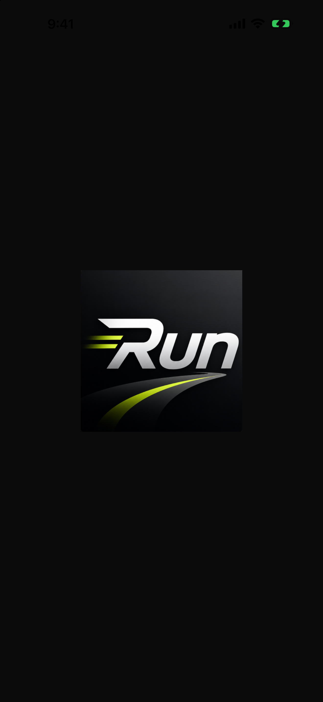 | 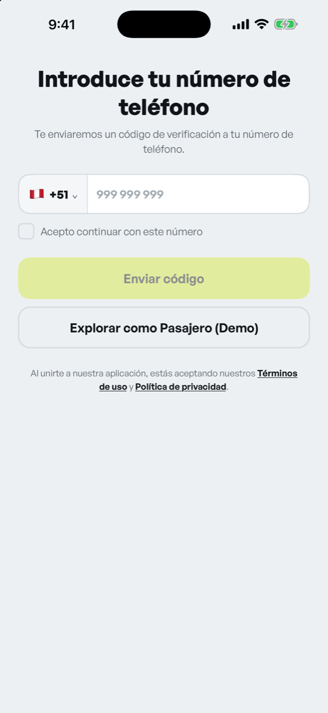 | 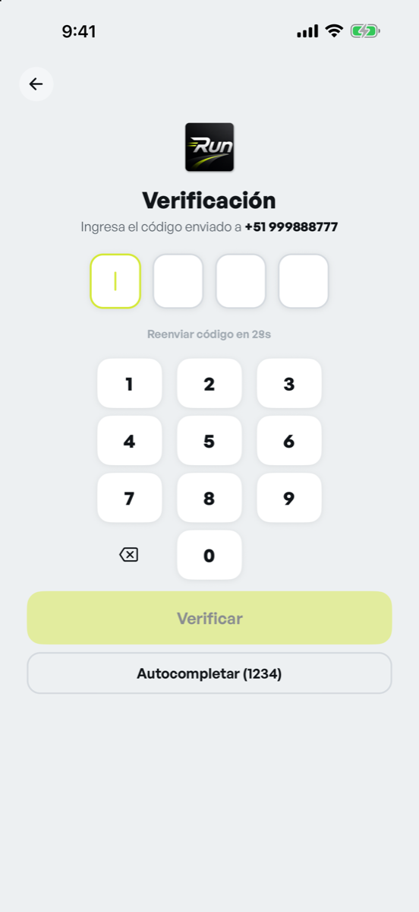 |
| *Logo de Run al abrir la*<br>*app* | *Número con prefijo de*<br>*país y acceso demo* | *Código de 4 dígitos con*<br>*teclado propio* |

### Pedir un viaje

| 04. Inicio | 05. Tu viaje | 06. Confort | 07. Servicios |
| :---: | :---: | :---: | :---: |
| 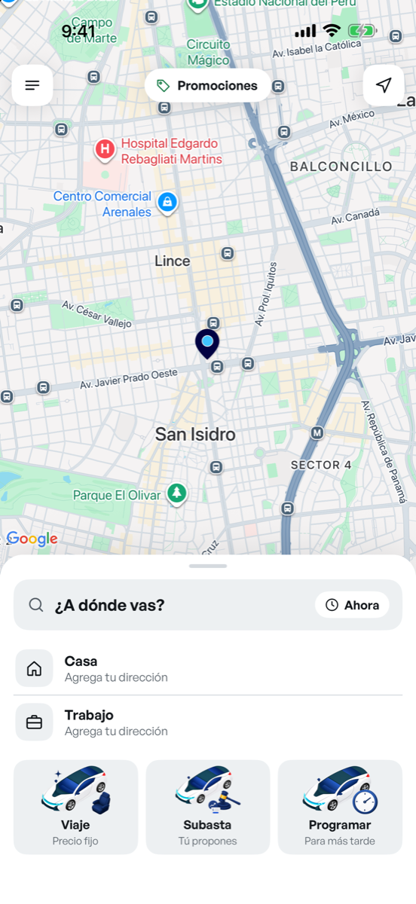 | 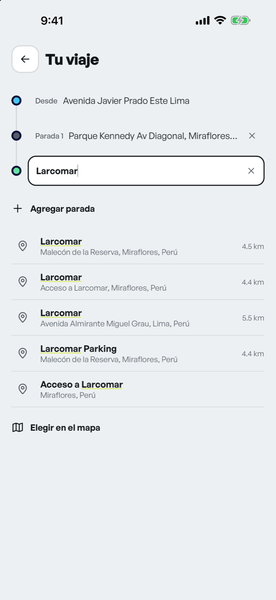 | 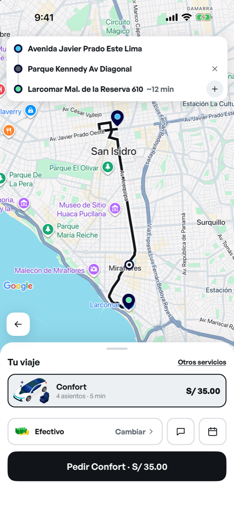 | 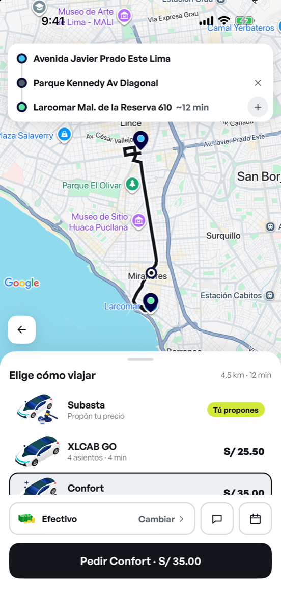 |
| *Mapa, favoritas y*<br>*accesos Viaje, Subasta y*<br>*Programar* | *Origen, paradas (hasta*<br>*2) y destino en una sola*<br>*pantalla* | *Ruta con parada, precio*<br>*fijo y flecha sobre la*<br>*hoja* | *Subasta, XLCAB GO,*<br>*Confort y más* |

### Subasta

| 08. Tu precio | 09. Recogida | 10. Ofertas |
| :---: | :---: | :---: |
| 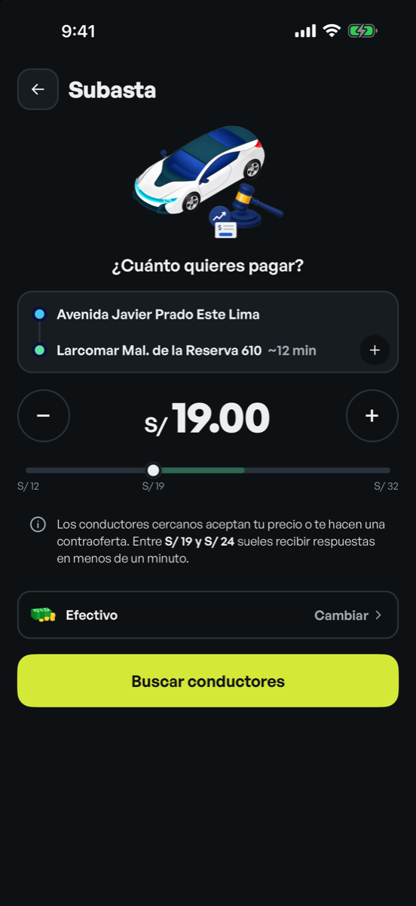 | 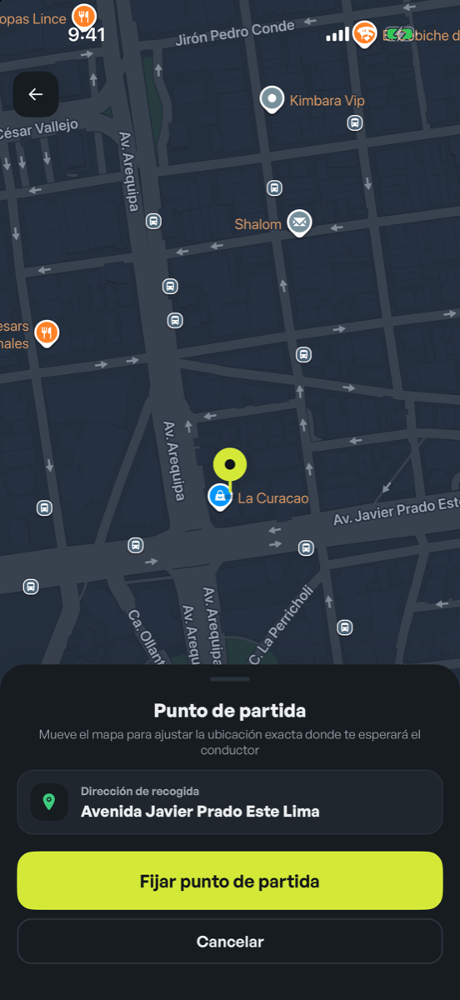 | 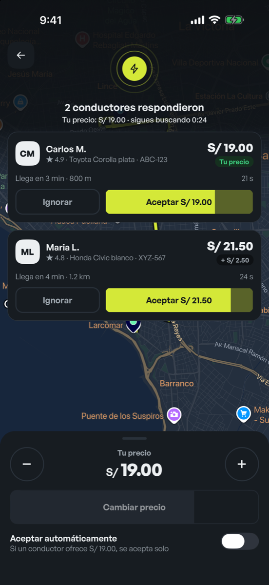 |
| *Tarifa con stepper,*<br>*slider y rango*<br>*recomendado* | *El mapa se acerca al*<br>*origen para ajustar la*<br>*recogida* | *Contraofertas con*<br>*contador y aceptación*<br>*automática* |

### Viaje en curso

| 11. Buscando | 12. En camino | 13. En viaje |
| :---: | :---: | :---: |
| 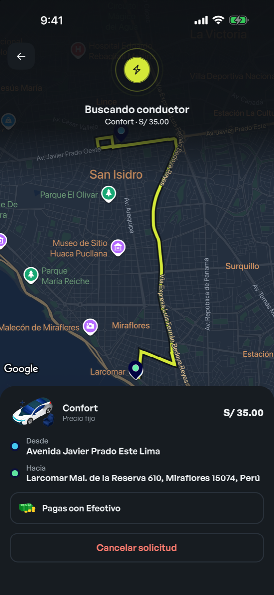 | 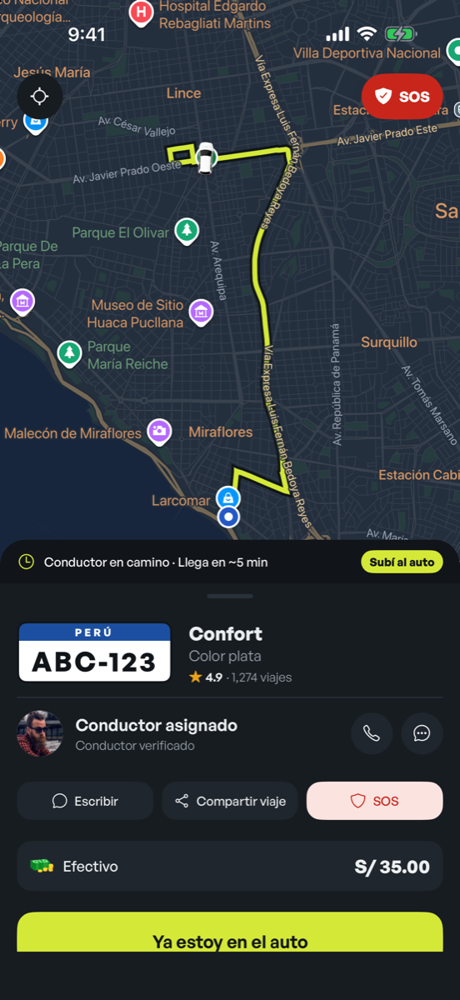 | 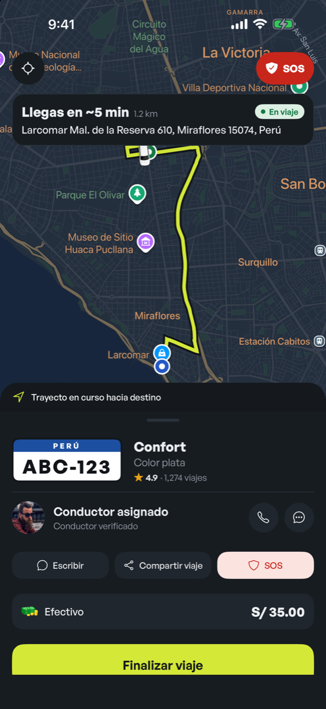 |
| *Resumen del pedido*<br>*mientras se asigna*<br>*conductor* | *Placa peruana, llamada,*<br>*chat, SOS y "Ya estoy en*<br>*el auto"* | *Tiempo de llegada,*<br>*trayecto y botón para*<br>*finalizar* |

### Programar para más tarde

| 14. Servicio | 15. Fecha | 16. Programados | 17. Detalle |
| :---: | :---: | :---: | :---: |
| 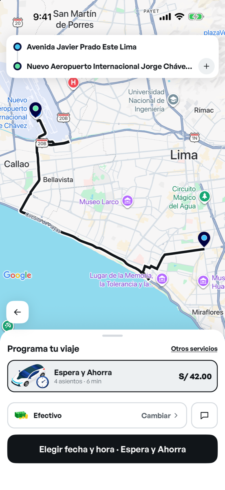 | 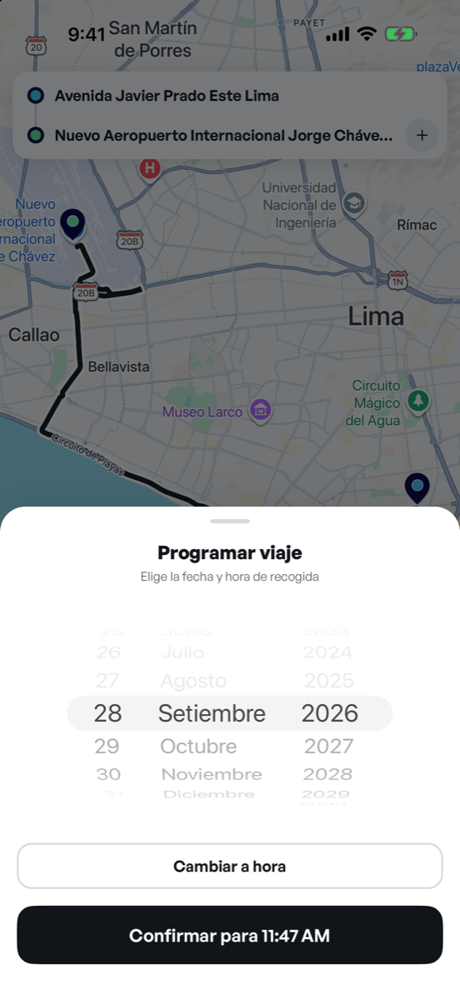 | 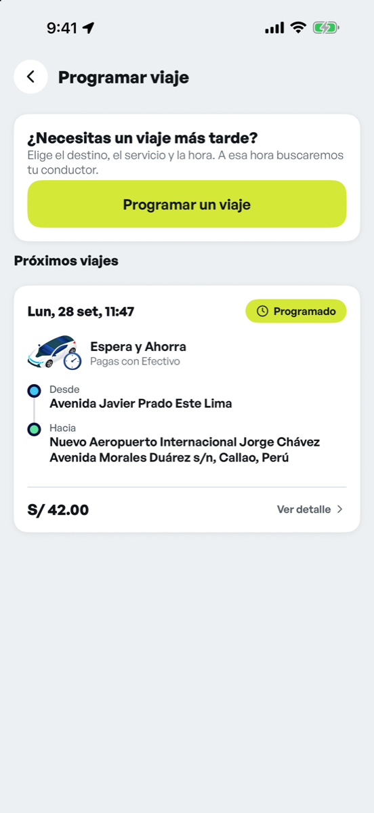 | 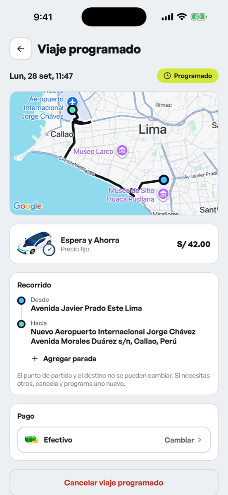 |
| *Destino → servicio*<br>*Espera y Ahorra* | *Selector en español,*<br>*legible en modo claro y*<br>*oscuro* | *Tarjetas con fecha,*<br>*servicio, pago y*<br>*recorrido* | *Mapa con ruta, paradas,*<br>*cambio de pago y*<br>*cancelación* |

### Menú, historial y modo oscuro

| 18. Menú | 19. Mis viajes | 20. Oscuro | 21. Oscuro |
| :---: | :---: | :---: | :---: |
| 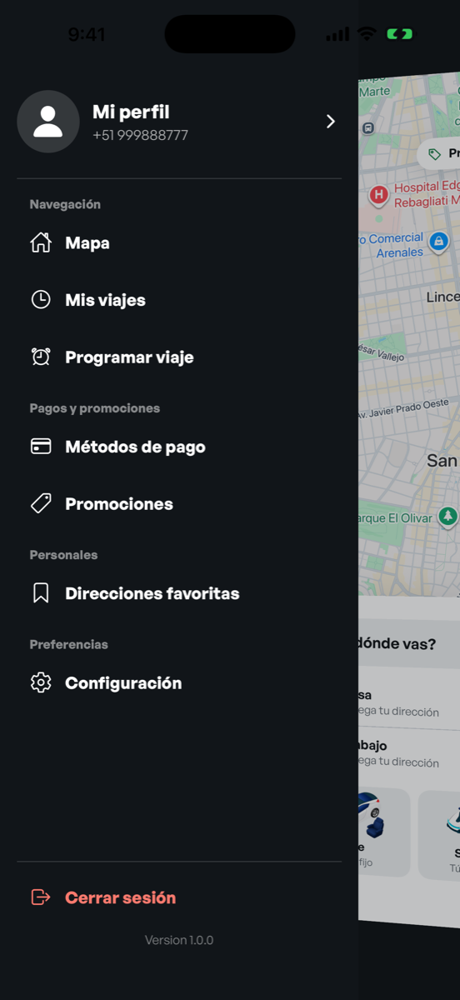 | 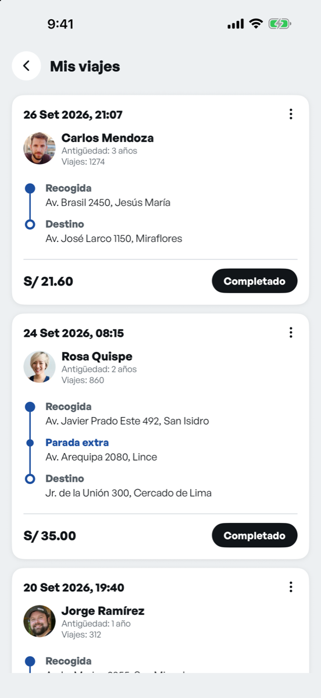 | 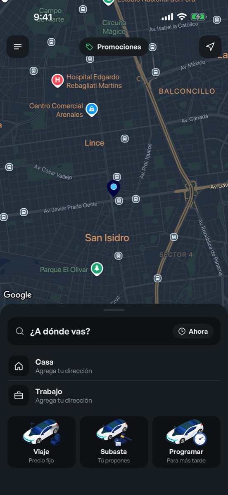 | 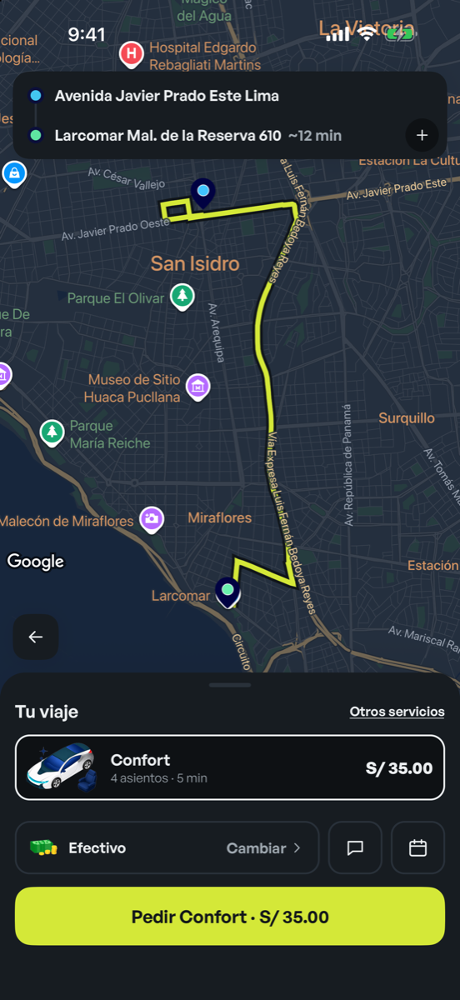 |
| *Menú con perfil,*<br>*secciones y cierre de*<br>*sesión* | *Historial con conductor,*<br>*recorrido y tarifa* | *Mapa oscuro y*<br>*componentes adaptados* | *Ruta y hoja de servicios*<br>*en modo oscuro* |

---

## ⚡ Características Principales

- **🤝 Modelo de Subasta en Tiempo Real:** El pasajero propone el monto de partida o acepta contraofertas de conductores cercanos con contador de caducidad por oferta.
- **🚕 Tres formas de viajar:** **Viaje** a precio fijo (Confort por defecto), **Subasta** donde tú propones el precio y **Programar** para más tarde con el servicio *Espera y Ahorra*.
- **📍 Paradas en el recorrido:** Hasta 2 paradas intermedias, agregadas en la misma pantalla y reflejadas en la ruta del mapa.
- **🗓️ Viajes programados:** Lista y detalle con mapa, edición de paradas, cambio de método de pago y cancelación; la búsqueda de conductor se lanza sola a la hora elegida.
- **🗺️ Mapas Fluidos con Google Maps:** Integración nativa de Google Maps tanto en iOS como en Android, polilíneas de ruta en alta precisión y geocodificación de direcciones en Lima.
- **🇵🇪 Pagos Locales Adaptados:** Soporte nativo para los métodos de pago más populares del Perú: **Efectivo**, **Yape** y **Plin**.
- **🚨 Seguridad & Confianza:**
  - Botón de **SOS** de acceso instantáneo.
  - Formato de **Placa Oficial Vehicular Peruana** (ej. `ABC-123`).
  - Posibilidad de **Compartir Viaje** en tiempo real.
  - Canales de llamada directa y mensajería en vivo con el conductor.
- **🎨 Design System Modular:**
  - Tokens de color y tipografía clara (**General Sans**).
  - Temas **Claro** y **Oscuro** integrados.
  - Feedback háptico (`expo-haptics`) en botones y confirmaciones.
  - Animaciones fluidas con `react-native-reanimated`.
- **♿ Accesibilidad Integral (A11y):** Componentes con roles semánticos (`accessibilityRole`), etiquetas contextuales y objetivos táctiles mínimos de 44×44 pt.

---

## 🏗️ Arquitectura y Tecnologías

El proyecto sigue una arquitectura por **Features**, desacoplando presentación, estado y servicios:

```
Run_Driver/
├── App.tsx                     # Punto de entrada, fuentes nativas y providers
├── app.json                    # Configuración de Expo y plugins de Google Maps
├── docs/                       # Documentación, especificaciones y capturas
│   ├── prompt-runsubasta-rediseno-ui.md
│   └── screenshots/            # Capturas del flujo móvil
├── src/
│   ├── config/                 # Variables de entorno y llaves API
│   ├── data/                   # Datos locales y soporte de países
│   ├── features/               # Módulos organizados por dominio
│   │   ├── auth/               # Login por teléfono y verificación OTP
│   │   ├── chat/               # Comunicación en vivo pasajero-conductor
│   │   ├── cliente/
│   │   │   ├── favoritas/      # Direcciones guardadas (Casa, Trabajo, etc.)
│   │   │   ├── home/           # Pantalla principal con mapa y drawer
│   │   │   ├── metodos-pago/   # Gestión de Efectivo, Yape y Plin
│   │   │   ├── perfil/         # Perfil de usuario y cuenta
│   │   │   ├── programar-viaje/# Reserva y programación anticipada
│   │   │   ├── promociones/    # Cupones y descuentos activos
│   │   │   ├── search/         # Búsqueda de direcciones y selección en mapa
│   │   │   ├── solicitud-taxi/ # Servicios, subasta y ofertas de conductores
│   │   │   └── trayecto-taxi/  # Seguimiento en camino y en viaje
│   │   ├── configuracion/      # Ajustes de tema, idioma y seguridad
│   │   └── historial/          # Historial de viajes realizados
│   ├── navigation/             # Configuración de React Navigation 7
│   ├── shared/                 # Componentes UI reutilizables, hooks y utilitarios
│   ├── store/                  # Estado global con Zustand
│   └── theme/                  # Tokens de diseño (Colores, Spacing, Fuentes)
└── __tests__/                  # Pruebas unitarias de stores y hooks
```

---

## 🚀 Comenzando

### Requisitos Previos

- **Node.js**: `v20.x` o superior
- **npm**: `v10.x` o superior
- **Watchman**: `brew install watchman` (en macOS)
- **Para iOS**: macOS con **Xcode 16+** y **CocoaPods**
- **Para Android**: **Android Studio** con Android SDK configurado

### 1. Clonar el repositorio

```bash
git clone https://github.com/VMichael1999/Run_Driver.git
cd Run_Driver
```

### 2. Instalar dependencias

```bash
npm install
```

### 3. Variables de Entorno

Copia el archivo de plantilla `.env.example` a `.env` y configura tu clave de Google Maps:

```bash
cp .env.example .env
```

Edita `.env`:
```env
EXPO_PUBLIC_GOOGLE_MAPS_API_KEY=tu_google_maps_api_key_aqui
```

---

## 💻 Ejecución del Proyecto

### Desarrollo con Expo (Metro Bundler)

```bash
npm start
```

### Ejecutar en iOS (Simulador o Dispositivo)

```bash
# Generar artefactos nativos de iOS
npx expo prebuild --platform ios

# Compilar y correr en el simulador de iOS
npx expo run:ios
```

> **Nota:** Para compilar en un dispositivo o simulador específico (ej. *iPhone 17 Pro Max*):
> ```bash
> npx expo run:ios --simulator="iPhone 17 Pro Max"
> ```

### Ejecutar en Android (Emulador o Dispositivo)

```bash
# Generar artefactos nativos de Android
npx expo prebuild --platform android

# Compilar y correr en Android
npx expo run:android
```

---

## 🧪 Pruebas y Calidad de Código

El proyecto cuenta con suites de pruebas unitarias automatizadas con **Jest** y tipado estricto con **TypeScript**:

```bash
# Ejecutar todas las pruebas con reporte de cobertura
npm run test:ci

# Verificación estricta de tipos de TypeScript
npx tsc --noEmit
```

### Estado de las Pruebas

```
Test Suites: 13 passed, 13 total
Tests:       57 passed, 57 total
Snapshots:   0 total
Coverage:    > 85% de cobertura general
```

---

## 📌 Guía de Uso del Flujo Demo

Para probar inmediatamente todas las pantallas sin configurar servicios SMS externos:

1. En la pantalla de login pulsa **"Explorar como Pasajero (Demo)"**, o ingresa un número ficticio (ej. `999 888 777`), pulsa **"Enviar código"** y luego **"Autocompletar (1234)"**.
2. En el inicio elige cómo quieres viajar:
   - **Viaje** (precio fijo): eliges el destino, puedes sumar hasta 2 paradas y pides **Confort** directamente (o tocas **"Otros servicios"**). La app busca conductor y pasa al seguimiento.
   - **Subasta**: eliges el destino, propones tu precio con `+` / `-`, fijas el punto de partida y aceptas una de las ofertas que llegan.
   - **Programar**: eliges el destino, el servicio **Espera y Ahorra** y la fecha y hora. El viaje queda en **Programar viaje** y la búsqueda empieza sola a esa hora.
3. En **"Conductor en camino"** pulsa **"Ya estoy en el auto"** para ver la pantalla **En viaje**.
4. Desde **Programar viaje** puedes abrir el detalle de cada viaje programado: agregar o quitar paradas, cambiar el método de pago o cancelarlo.
5. Puedes alternar el **Modo Oscuro** en cualquier momento desde **Configuración** en el menú lateral.

---

## 👥 Contribución y Créditos

Desarrollado como parte de la plataforma **Run Driver / RunSubasta**.

- **Repositorio:** [VMichael1999/Run_Driver](https://github.com/VMichael1999/Run_Driver)
- **Rama activa:** `feat/redesign-ui`
